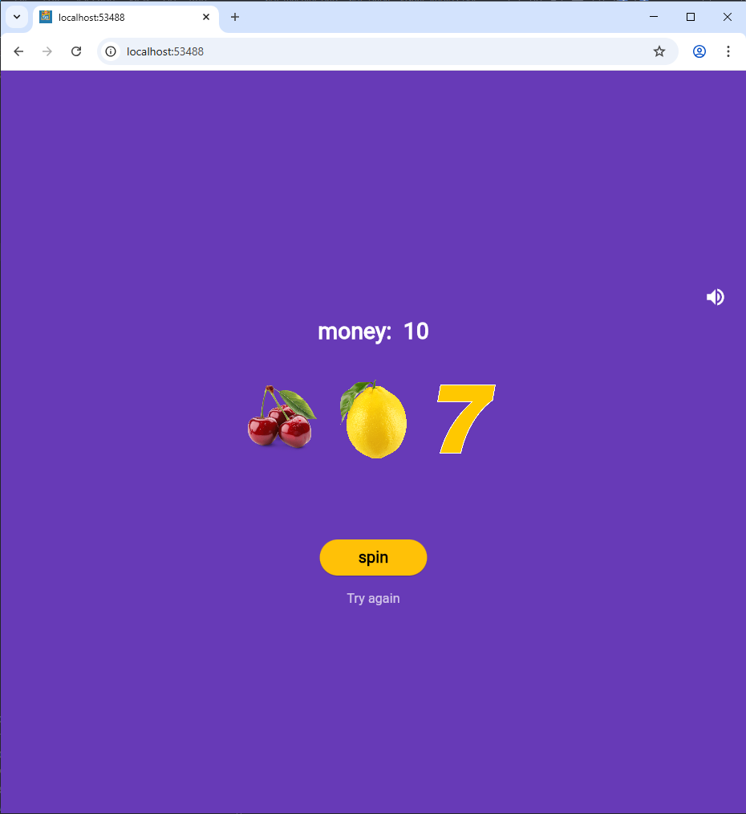
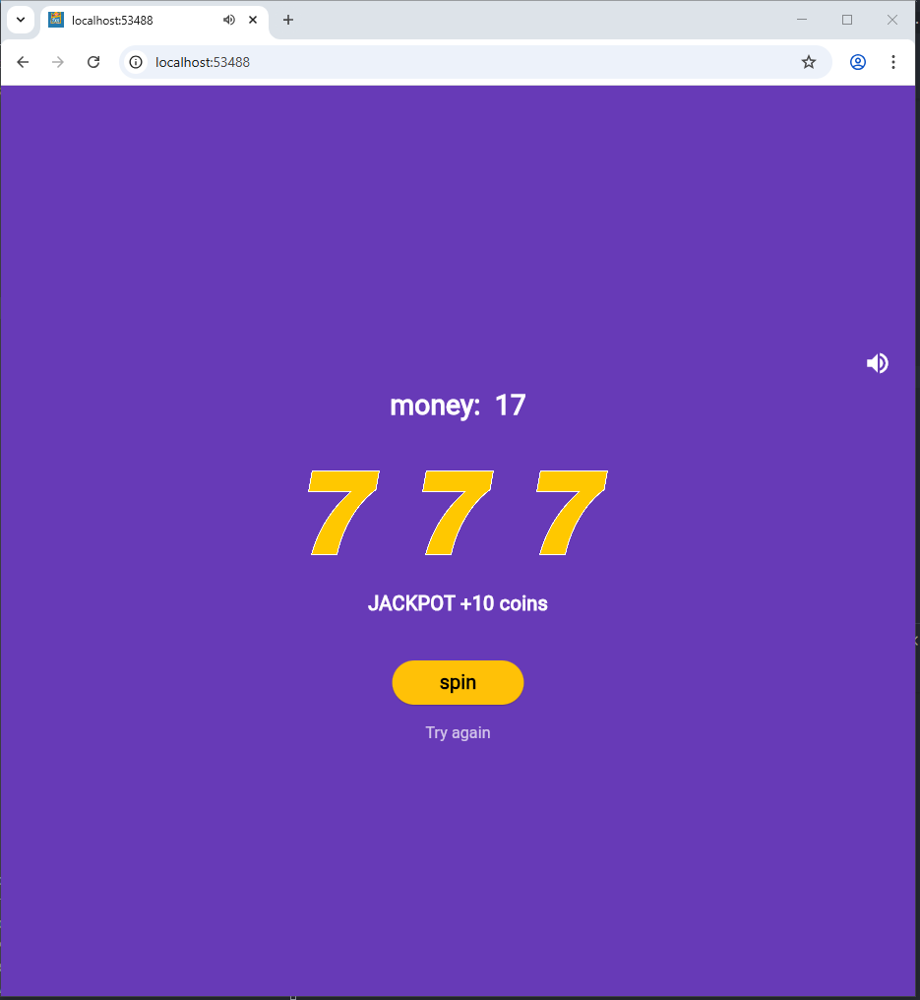
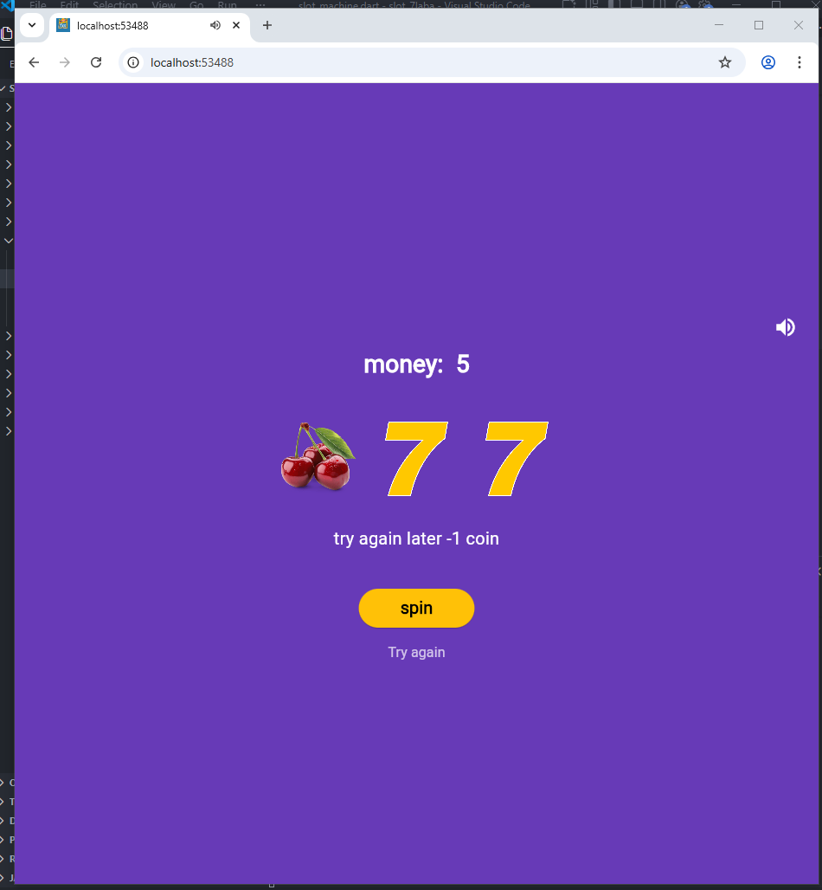

# Учебное приложение. 🎰Слот-машина

Простое Flutter-приложени - симулятор казино. Крути барабаны, собирай одинаковые символы и выигрывай монеты

📱## Скриншиты






🕹## Как играть

- Нажми КРУТИТЬ чтобы запустить барабан
- Три одинаковых сивола - победа (3 монеты)
- три 7 - джекпот(+10 монет)
- разные символы - проигрышь
- Начините заново кнопкой Начать заново

🚀## Запуск проекта

```
git clone https://github.com/Quazort/Flutter_7laba.git
```

установить зависимости
```
flutter pub get
```


запустить приложение
```
flutter run -d chrome
```

📚## Тенологии 

- Flutter 3.41.2
- Dart 3.11.0
- Платформы Web, Android

## Что изучено

- Работа с изображениями Image.asset()
- генерация случайных чисел через dart:math
- Сборка под Web и Android


## Авторы
Кузнецов А Вахрушева А ИСП-233